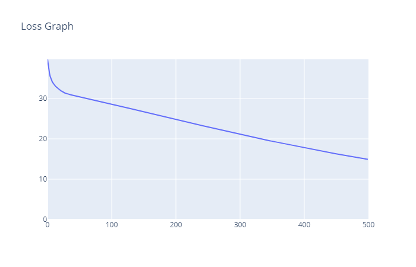
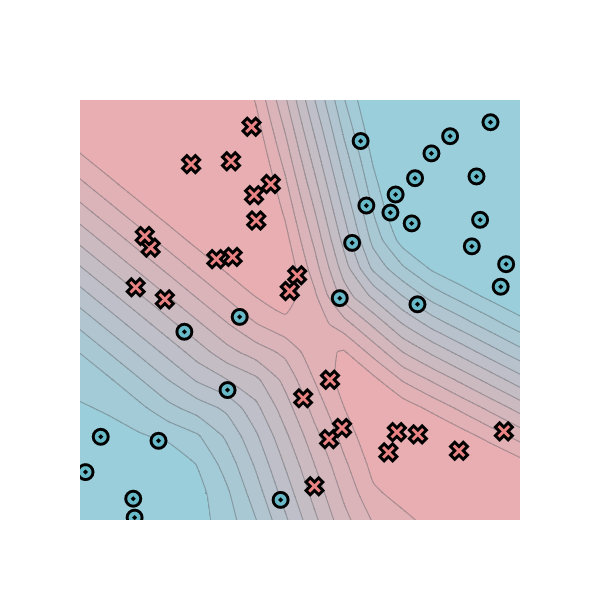
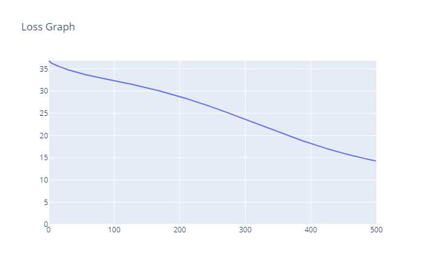
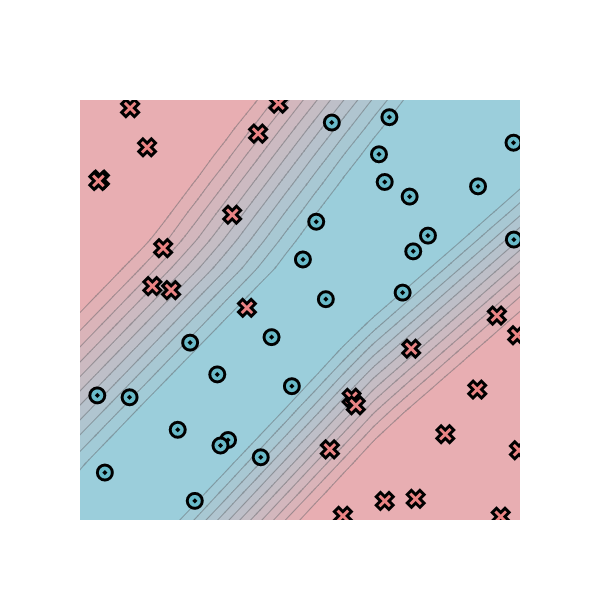

# Node

- Tests can be directly run for a particular module by running test_cases.py.

# Module 0

- Task 1 : All cases passed.
- Task 2 : All cases passed.
- Task 3 : All cases passed.
- Task 4 : All cases passed.

Training Log from stremlit.

# Module 1

- Task 1 : All cases passed.
- Task 2 : All cases passed.
- Task 3 : All cases passed.
- Task 4 : All cases passed.

Training Log from stremlit.

# Module 2

- Task 1 : All cases passed.
- Task 2 : All cases passed.
- Task 3 : All cases passed.
- Task 4 : All cases passed.

Training Log by running project/run_tensor.py

- Epoch  10  loss  32.51997115283502 correct 33
- Epoch  20  loss  30.897578522228304 correct 35
- Epoch  30  loss  28.447662315301987 correct 37
- Epoch  40  loss  25.829679838492783 correct 42
- Epoch  50  loss  28.855379380632204 correct 31
- Epoch  60  loss  21.418467508835917 correct 41
- Epoch  70  loss  22.478332377809437 correct 38
- Epoch  80  loss  18.753274126056635 correct 40
- Epoch  90  loss  17.664016634030666 correct 41
- Epoch  100  loss  18.43777853030659 correct 42
- Epoch  110  loss  16.302663391568387 correct 43
- Epoch  120  loss  15.715455056583208 correct 44
- Epoch  130  loss  20.547121449808174 correct 42
- Epoch  140  loss  12.750417977908768 correct 45
- Epoch  150  loss  12.94845865134652 correct 45
- Epoch  160  loss  15.059114581337077 correct 44
- Epoch  170  loss  10.126789055833559 correct 46
- Epoch  180  loss  9.90481270719114 correct 46
- Epoch  190  loss  11.105877902107984 correct 46
- Epoch  200  loss  11.464768163965031 correct 45
- Epoch  210  loss  7.28122728408203 correct 46
- Epoch  220  loss  12.082889302836644 correct 45
- Epoch  230  loss  9.39664230738754 correct 45
- Epoch  240  loss  7.251741131179395 correct 46
- Epoch  250  loss  9.242779840607817 correct 46
- Epoch  260  loss  9.280790504201313 correct 45
- Epoch  270  loss  7.054805085835282 correct 46
- Epoch  280  loss  9.359869788607249 correct 45
- Epoch  290  loss  9.305431977756314 correct 45
- Epoch  300  loss  5.914539136630714 correct 48
- Epoch  310  loss  6.07820894450654 correct 48
- Epoch  320  loss  8.915411700901949 correct 44
- Epoch  330  loss  6.843672036014391 correct 46
- Epoch  340  loss  3.5852386193061156 correct 49
- Epoch  350  loss  3.701009017857785 correct 49
- Epoch  360  loss  6.834332972161726 correct 47
- Epoch  370  loss  10.66320523409248 correct 45
- Epoch  380  loss  5.427523667109844 correct 48
- Epoch  390  loss  4.258444996437434 correct 48
- Epoch  400  loss  4.451835216169547 correct 48
- Epoch  410  loss  5.032692165582485 correct 48
- Epoch  420  loss  4.151463132788643 correct 48
- Epoch  430  loss  3.757823963946715 correct 48
- Epoch  440  loss  3.1421265830256955 correct 49
- Epoch  450  loss  4.6566701096091405 correct 48
- Epoch  460  loss  3.7143305609375883 correct 49
- Epoch  470  loss  23.60245016565512 correct 42
- Epoch  480  loss  3.61168320820839 correct 49
- Epoch  490  loss  2.9553372026631974 correct 49
- Epoch  500  loss  2.59083902945179 correct 49

# Module 3

- Task 1 : All cases passed.
- Task 2 : All cases passed.
- Task 3 : All cases passed.

# Module 4

- Task 1 : All cases passed.
- Task 2 : All cases passed.
- Task 3 : All cases passed.
- Task 4 : All cases passed.

Traing log from running run_mnist_multiclass.py
Batch_size = 16
Epoch  1  loss  2.3550804008232515 correct 3
Epoch  1  loss  11.46518025451698 correct 2
Epoch  1  loss  11.292974719720531 correct 3
Epoch  1  loss  10.799883298922614 correct 7
Epoch  1  loss  10.190266425468923 correct 9
Epoch  1  loss  8.550840254323298 correct 5
Epoch  1  loss  7.262999542396277 correct 9
Epoch  1  loss  7.238678123152511 correct 11
Epoch  1  loss  7.729340738374804 correct 10
Epoch  1  loss  5.621339299592101 correct 11
Epoch  1  loss  6.969014283115802 correct 12
Epoch  1  loss  5.992705151529989 correct 15
Epoch  1  loss  5.051194577679038 correct 15
Epoch  1  loss  5.103138726374484 correct 11
Epoch  1  loss  5.291331144438607 correct 11
Epoch  1  loss  3.742622692372273 correct 10
Epoch  1  loss  5.6979580740491835 correct 14
Epoch  1  loss  4.485479094166836 correct 12
Epoch  1  loss  3.8340685905627434 correct 14
Epoch  1  loss  3.4381679802173433 correct 13
Epoch  1  loss  3.3519959399226837 correct 13
Epoch  1  loss  3.341595171808413 correct 14

--- Stopped Training. It seemed from the log above the model was learning well enough. The training was taking a lot of my time on my system.----
